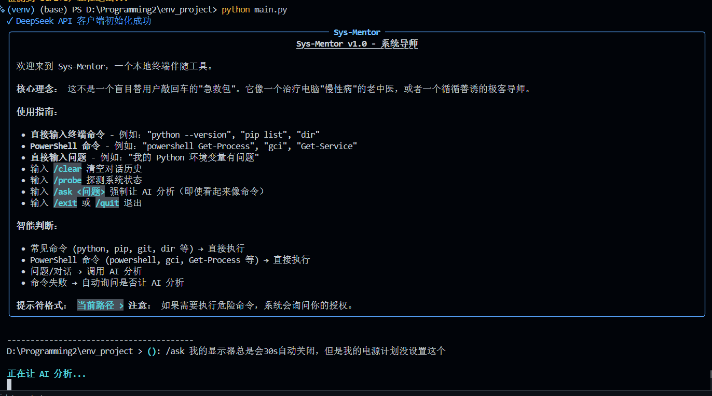
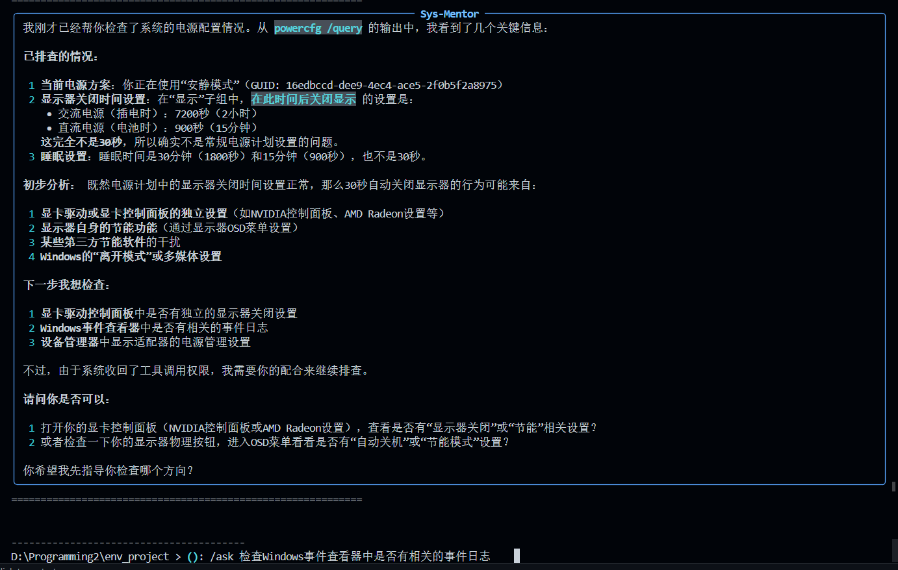
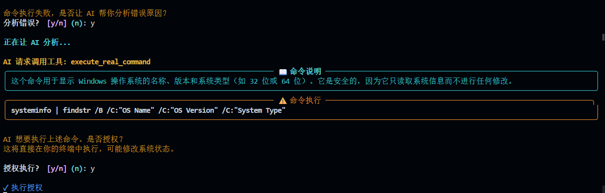
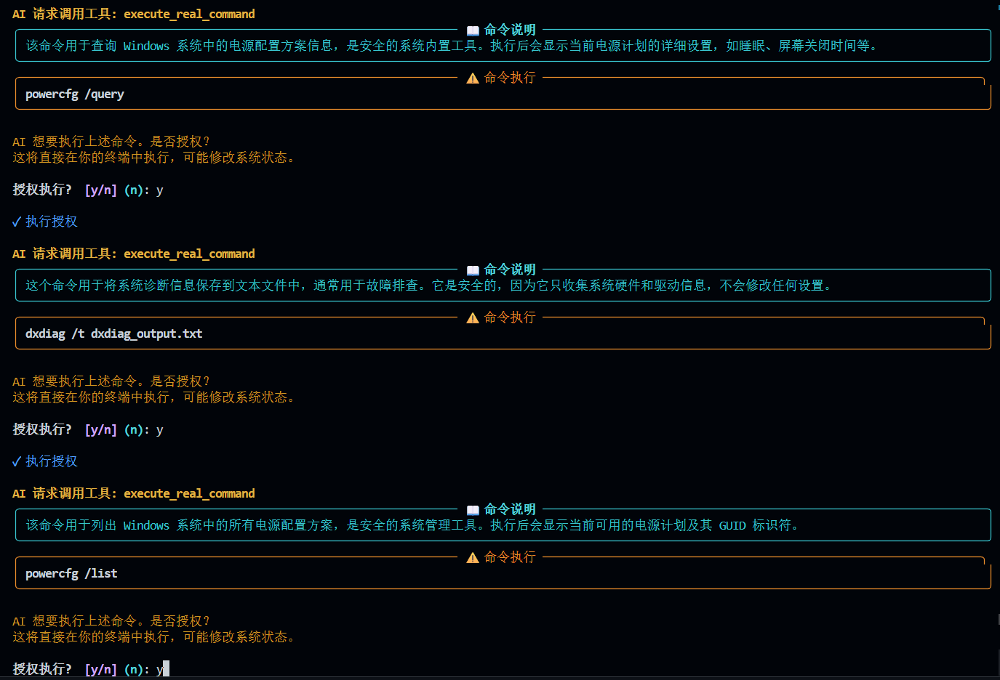

# Sys-Mentor 🧠

> **别再用"重启试试"解决电脑问题了！**
> 
> 一个像老中医把脉一样，带你深入理解电脑"慢性病"的 AI 终端导师

[](https://www.python.org/)
[](https://platform.deepseek.com/)
[](LICENSE)
[](https://github.com/Decent898/Sys-Mentor)


---

## 🚀 为什么选择 Sys-Mentor？

```
❌ 普通 AI 助手："运行这个命令就好了"
✅ Sys-Mentor   ："让我带你看看为什么会出现这个问题..."
```

当你遇到 **环境配置、工业软件安装（MATLAB/SolidWorks）或系统报错** 时：

| 其他工具 | Sys-Mentor |
|---------|-----------|
| 直接给命令，黑盒执行 | 🔍 先探测系统状态，分析根因 |
| 治标不治本 | 🧠 解释底层原理（DLL 加载、PATH 遍历、注册表） |
| 同样的问题反复出现 | 📚 让你真正理解，下次自己解决 |
| 盲目安装一堆软件 | 🎯 精准定位，最小化修改 |

---

## 💡 核心特性


---

### 🔍 系统探针 - 像 CT 扫描一样透视你的系统

```python
# 自动探测
- OS 架构、PATH 变量遍历顺序
- Python 解释器实际指向
- NVIDIA/CUDA 驱动状态
- Windows 注册表（MSVC 运行库等）
- 设备管理器中的硬件状态
```

### 🌐 联网搜索 - 获取最新解决方案

```python
# 使用 DuckDuckGo 实时检索
- GitHub Issues 最新讨论
- 技术博客和论坛
- 官方文档更新
```

### ⚡ 安全命令执行 - 你的系统你做主



```
⚠️  危险命令
│ powershell Get-Service Audiosrv

📖 命令说明
│ 查询音频相关服务的状态（如 Windows Audio 服务）

AI 想要执行上述命令。是否授权？
授权执行？[y/N]: █
```

**每一次执行都需要你的明确授权！**

---

## 📦 快速开始

### 30 秒启动

```bash
# Windows
run.bat

# Linux/Mac
chmod +x run.sh && ./run.sh
```

### 手动安装

```bash
# 1. 克隆项目
git clone https://github.com/Decent898/Sys-Mentor.git
cd Sys-Mentor

# 2. 创建虚拟环境
python -m venv venv

# 3. 激活虚拟环境
# Windows
venv\Scripts\activate
# Linux/Mac
source venv/bin/activate

# 4. 安装依赖
pip install -r requirements.txt

# 5. 配置 API 密钥
copy .env.example .env  # Windows
cp .env.example .env    # Linux/Mac
# 编辑 .env 文件，填入你的 DeepSeek API 密钥
```

---

## 🎯 使用示例

### 启动程序

```bash
python main.py
```

### 真实对话示例

```
(Sys-Mentor) > 我的 Python 环境变量有问题，pip 命令找不到

🔍 正在探测系统状态...

分析：
我发现了问题所在。你的 PATH 中有 3 个 Python 安装路径：
1. C:\Users\...\anaconda3\Scripts    ← 优先级最高
2. C:\Python312\Scripts              ← 但你实际想用这个
3. D:\...\venv\Scripts

建议执行以下命令调整 PATH 顺序：
[命令预览和解释]

授权执行？[y/N]:
```

### 内置指令

| 指令 | 说明 |
|------|------|
| `/clear` | 清空对话历史 |
| `/probe` | 探测当前系统状态 |
| `/search <关键词>` | 搜索相关问题 |
| `/exit` | 退出程序 |

---

## 🛠️ 技术栈

```
┌─────────────────────────────────────────┐
│  前端 UI    │  Rich (终端富文本)        │
│  大模型     │  DeepSeek API (Tool Call) │
│  系统交互   │  subprocess (真实 Shell)  │
│  网络搜索   │  DuckDuckGo Search        │
│  日志系统   │  Python logging           │
└─────────────────────────────────────────┘
```

---

## 📁 项目结构

```
env_project/
├── main.py              # 🎯 主程序 - REPL 循环
├── tools.py             # 🔧 核心工具函数
├── requirements.txt     # 📦 依赖列表
├── .env.example         # 🔑 环境变量示例
├── .gitignore          # 🚫 Git 忽略文件
├── run.bat             # 🪟 Windows 启动脚本
├── run.sh              # 🐧 Linux/Mac 启动脚本
├── test_local.py       # 🧪 本地测试脚本
├── QUICKSTART.md       # 📖 快速开始指南
├── ARCHITECTURE.md     # 🏗️ 系统架构文档
├── PROJECT_STATUS.md   # 📊 项目进度
└── BUGFIX_LOG.md       # 🐛 Bug 修复日志
```

---

## 🔧 高级配置

### 日志级别控制

在 `.env` 文件中设置：

```bash
# 可选值：debug, info, warning, error, off (默认：off)
SYS_MENTOR_LOG=off
```

### 自定义 API 端点

```bash
DEEPSEEK_API_BASE_URL=https://your-custom-api.com/v1
```

---

## 🤝 贡献指南

欢迎提交 Issue 和 Pull Request！

```bash
# 1. Fork 本项目
# 2. 创建特性分支
git checkout -b feature/AmazingFeature

# 3. 提交更改
git commit -m 'Add some AmazingFeature'

# 4. 推送到分支
git push origin feature/AmazingFeature

# 5. 开启 Pull Request
```

---

## 📝 许可证

MIT License - 详见 [LICENSE](LICENSE) 文件

---

## 👨‍💻 关于作者

**Decent898**

一个热爱底层技术的极客，相信"授人以鱼不如授人以渔"。

- GitHub: [@Decent898](https://github.com/Decent898)
- Email: decent898@gmail.com

---

## ⭐ 支持项目

如果这个项目对你有帮助，请给一个 ⭐ Star！

[](https://star-history.com/#Decent898/Sys-Mentor&Date)

---

## 📮 常见问题

<details>
<summary><b>Q: 需要付费的 API 密钥吗？</b></summary>
<br>
是的，本项目使用 DeepSeek API。请前往 <a href="https://platform.deepseek.com/">DeepSeek 开放平台</a> 注册并获取 API 密钥。
</details>

<details>
<summary><b>Q: 会修改我的系统文件吗？</b></summary>
<br>
所有可能修改系统的命令都需要你的明确授权。AI 会先解释命令的作用，你确认后才执行。
</details>

<details>
<summary><b>Q: 支持哪些操作系统？</b></summary>
<br>
Windows、Linux、macOS 均支持。部分命令在不同系统上会自动使用替代方案。
</details>

---

**最后更新**: 2026 年 3 月 22 日

---

<div align="center">

**Made with ❤️ by Decent898**

如果这个项目帮到了你，请考虑给一个 ⭐ Star 支持！

</div>
